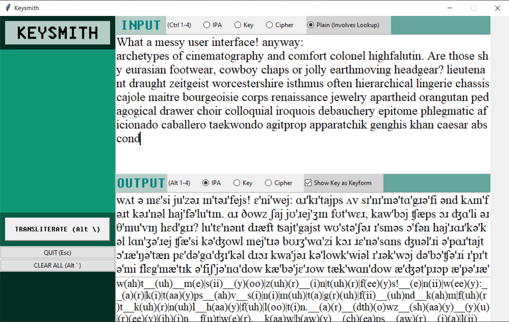

[Github](https://github.com/jonjau/cifero)

64-bit Windows 10 / Linux executables are available on the Github page.

Cifero is a Python GUI (PyQt5) program for (esoteric)
phonetic transliteration and syllable separation. Transliterates sentences to
and from: dictionary English, IPA, a "typable" IPA, a "readable" IPA, and a
phonetic cipher. Currently punctuation is a problem.

The dictionary used is the
[CMU pronouncing dictionary](http://www.speech.cs.cmu.edu/cgi-bin/cmudict).

This was my first non-trivial application, after
[reading](https://www.amazon.com/Programming-Principles-Practice-Using-C/dp/0321543726)
[a](https://nostarch.com/automatestuff2)
[few](https://www.amazon.com/Fluent-Python-Concise-Effective-Programming/dp/1491946008)
[books](https://buildmedia.readthedocs.org/media/pdf/howtothink/latest/howtothink.pdf).

## Keysmith

Initially, I wanted to do this project in pure Python with Python libraries.
This meant working with Tkinter, which was low-level in the sense that there
weren't many UI elements you get for free. The UI layout management got really
messy, so I gave up on allowing resizable windows, and hardcoded most of the
layout. This corner cutting ended up making every additional change very
fiddly. The program itself was functional, but it was impossible to polish
(though clearly, it's not polished even now).

This iteration of the program was called Keysmith, and I imagined distributing
it would involve a lot of hacks, so I moved on and thought about rewriting the
interface in some other framework, something more "drag-and-drop".

I ended up looking into Qt, a well-known GUI framework that claimed to be
cross-platform. I did a
[sample C++ project](https://github.com/jonjau/countdown)
in it and redesigned the Keysmith interface in QtDesigner. What I saw was what
I got, and what I got was resizable windows, plus a two-click conversion into
Python code, via PyQt5. I tried running it in an Ubuntu VM and sure enough, it
looked like it belonged there -- cross-platform indeed.

This one I called Cifero, which sounds like what the word for "cipher" would
be in Esperanto (I don't think it's cifero).

## Features

* Cross-platform Qt GUI, designed in QtDesigner
* Regex-based syllable separation of English words
* Phonetic transliteration of English words in IPA or a more pronounceable
  form of it
* Transcription to and from IPA and my esoteric writing systems

## Screenshots




## Sample text

Here's the sample text (mostly obscure loanwords):

```_
Hello World, look at this syllable separation:
archetypes of cinematography and comfort colonel highfalutin. Are those shy
eurasian footwear, cowboy chaps or jolly earthmoving headgear?

lieutenant draught zeitgeist worcestershire isthmus often hierarchical
lingerie chassis cajole maitre bourgeoisie corps renaissance jewelry
apartheid orangutan pedagogical drawer choir colloquial iroquois debauchery
epitome phlegmatic aficionado caballero taekwondo agitprop apparatchik
genghis khan caesar abscond
```
