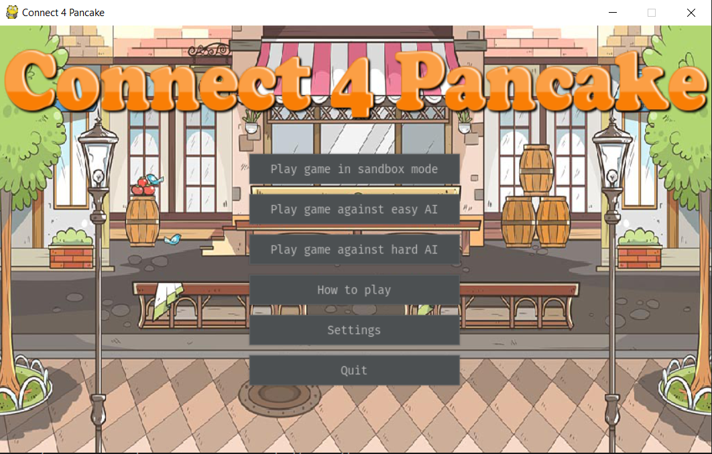
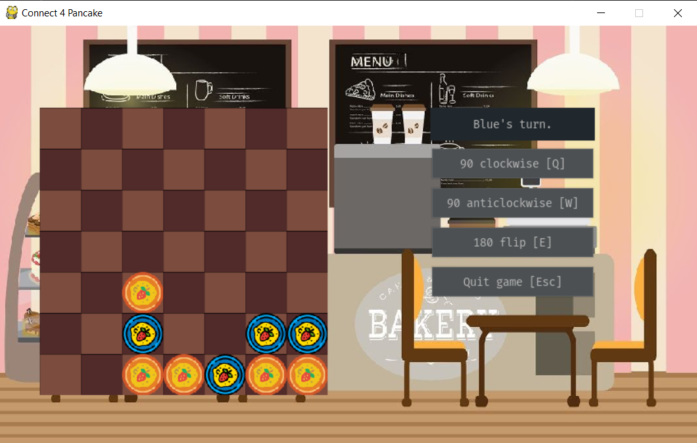

* [Submission](https://jhan1.itch.io/connect-4-pancake)
* [Github](https://github.com/jonjau/connect-4-pancake)

A Windows 10 executable (no installation needed) is available from both
links. Otherwise, building from source is an option. Additional details are
on the Github repo.

## Features

* Themed GUI
* (loud!) background music
* Easy/hard AI opponents
* Fully animated board
* Customisable board sizes

## Screenshots

