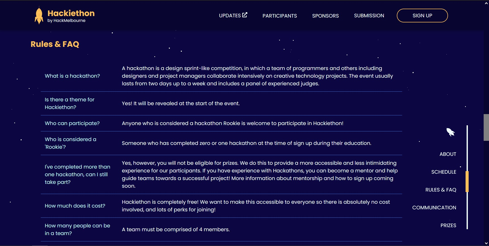
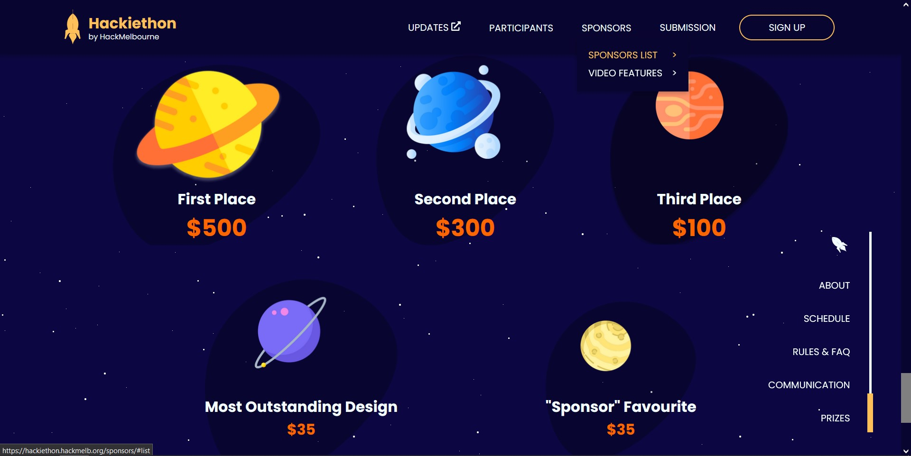
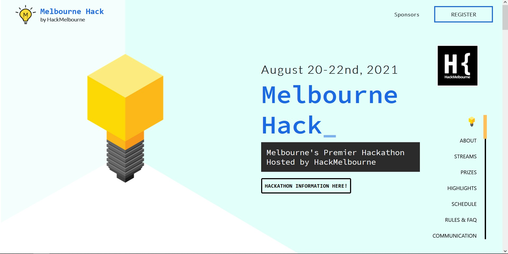

* [Hackiethon Website](https://hackiethon.hackmelb.org)
* [HackMelbourne](https://hackmelb.org)
* [Melbourne Hack Website](https://melbournehack.hackmelb.org)

I built this website with React, Typescript and Sass, from a finished design
which was done by [@mispelledname](https://github.com/mispelledname).

The website is hosted on Firebase, and the domain registration and DNS
services are from Namecheap. This time, deploying to a subdomain was
surprisingly straightforward.

The scroll component on the bottom right was a really tricky bit, and
it's not perfect, but it works most of the time... It was reused in
the website for **Melbourne Hack 2021**, which was another online hackathon
hosted by HackMelbourne. I also helped out in its implementation, and set up
the deployment on GitHub Pages, instead of Firebase. With guidance, I
succeeded in automating deployment using GitHub actions -- my first time using
the stuff.

## Gallery

