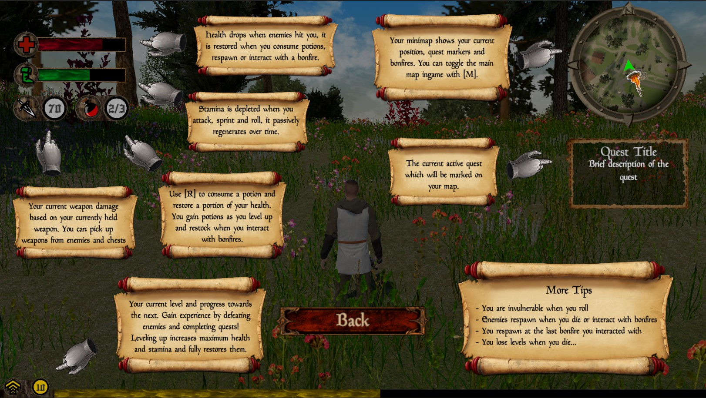
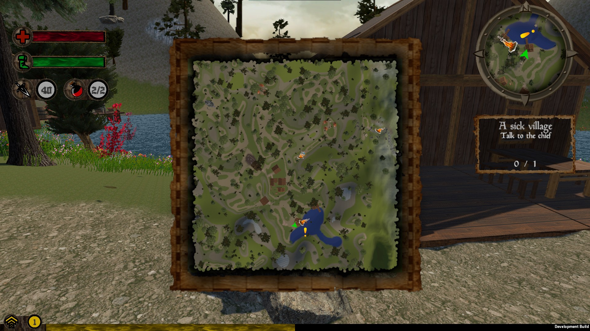

* [Game Playthrough](https://www.youtube.com/watch?v=iCOplFOJvow)
* [Game Trailer](https://www.youtube.com/watch?v=nLOWhwDyKM0)

Layman's Quest is an action adventure RPG centered around the main character
embarking on a quest to find a cure for a mysterious disease that plagued his
hometown Middleton. The player explores a large open world with chests and
other interactables, guided by checkpoints, quests and dialogue with
characters, along the way defeating enemies in third-person action combat,
leveling up and obtaining stronger weapons.

This was my team's submission for Project 2 of COMP30019 at the University of
Melbourne, Semester 2 2021. That dream team being:

* Marco Altieri
* Justin Chen
* Jonathan Jauhari
* Jun Hee Han

## Concept

We discussed the game concepts and set targets in the first two weeks of
development. Being epic gamers, we understood the classic RPG tropes and just
went with them: medieval, low fantasy, save-the-world, etc. The aesthetic was
meant to be informed by both grittier titles like *The Witcher 3* (UI) and
*The Elder Scrolls Online* (background music), but also with the brightness of
*Genshin Impact* (sound effects). We quickly realized it was difficult to
exactly nail a specific look-and-feel for the game when working with random
free assets.

> Currently, all the game's assets are free to use, but perhaps not
> commercially. All artistic assets such as character models and animations
> were either from [the Unity Asset Store](https://assetstore.unity.com/),
> or from downloaded for free from YouTube and other game asset sites.

As for gameplay, we liberally took inspiration from (read: ripped off) series
like *Dark Souls*, in the combat system, the boss fight, and how the
checkpoints work. But the game is hardly challenging, due to the less cunning
AI and forgiving potion system. I would say the standout features ended up
being the quest/dialogue system, the map itself, the enemy and weapon variety,
and the visual effects, all of which aren't really transplanted from any
particular game.

## Development

After the deciding the game's overall direction, we divided work broadly into
two areas: the environment and the game systems. Particle effects, custom
shaders and procedural generation were a large part of the assessment, and so
my team initially generated the terrain with a custom script which was then
populated with assets manually, as well as wrote the shaders and prepared the
particle effect to be put in later.

In parallel, I added character models, animations and set up player/camera
controls and movement. Once those controls were set, we did an initial merge,
where we had basic gameplay and a game world to start. We branched off and
worked on the other game features from there, merging code and assets around
once a week. Besides the combat system, enemy AI, player and camera, I also
worked on the menus and UI elements, yet another part of the assessment.

Having zero experience in developing a Unity 3D game, each of us turned to
resources on the internet to work on the game aspects piecemeal. In my case, I
adapted the AI, camera, and combat system from
[the Dark Souls Series by Sebastian Graves](https://www.youtube.com/watch?v=HKMo3pczQyc&list=PLD_vBJjpCwJtrHIW1SS5_BNRk6KZJZ7_d).
Among other things, I omitted the more interesting aspects, and switched up
the animations.

In the face of other assignments and exams, we finished most of the game in
the last month before the deadline. Getting Unity to work with Git became
extremely finicky as we accumulated more and more assets. Meta files and logs
would constantly be overwritten, and this ended up causing **excessive**
grief, and a critical bug in our final submission. Of course, it also became
harder to guarantee a bug-free experience as the game rapidly grew more
complex. Our repo went past 20 GB at submission, when including all the stuff
that Git ignores. It would be interesting to learn how actual game studios
split work and test their game...

Development sped up just before the trailer release (2 weeks before the
deadline), and we collected feedback from friends shortly after that. Then, we
actually addressed all the points brought up and added even more content. The
feature list ended up being massive, and we somehow met all of the ambitious
targets we set out at the onset of the project.

## Gallery

To see the game in action, see the playthrough I did, linked above.

UI guide accessible in the pause menu:

  

Real-time map UI, first half of the game map:

  

Starting area, and the leaf particle system:

  

Midgame optional area, combat and looting interactions:

  

Final stage, boss fight, a custom shader:

  

