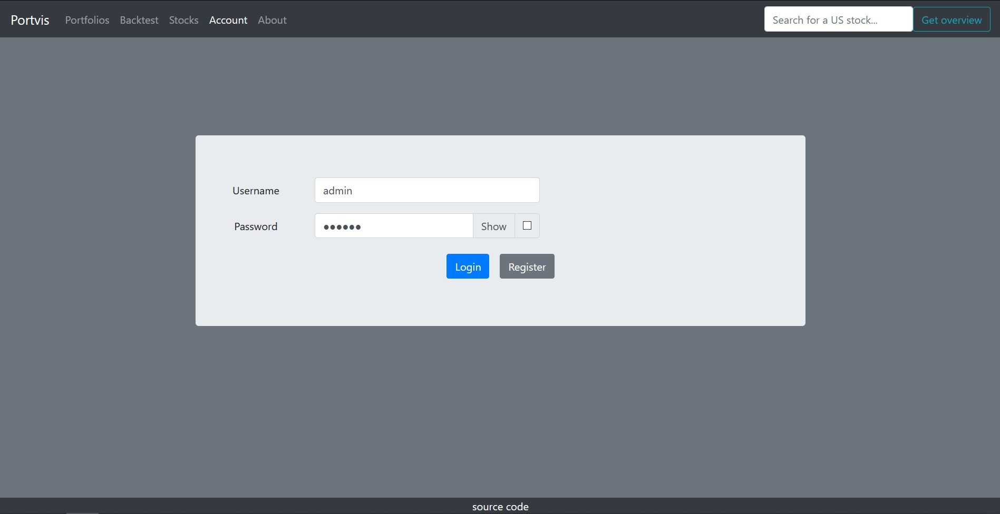
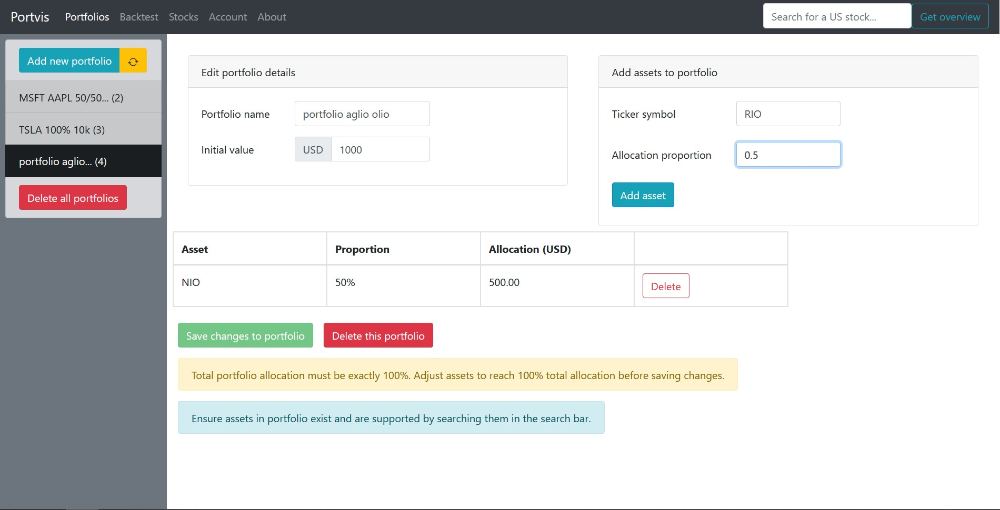
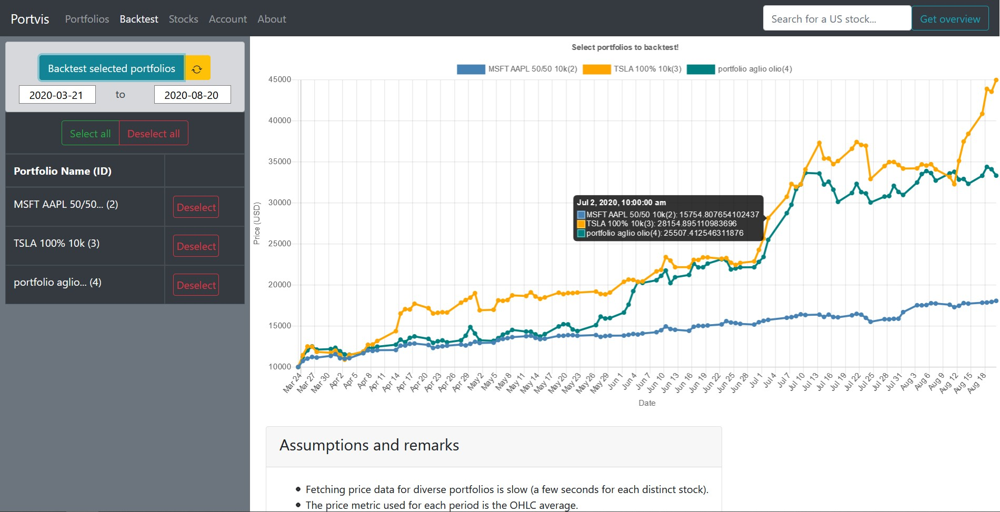
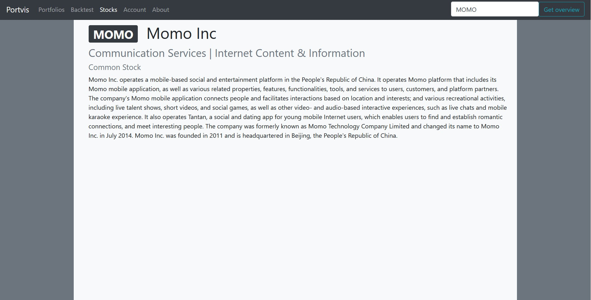
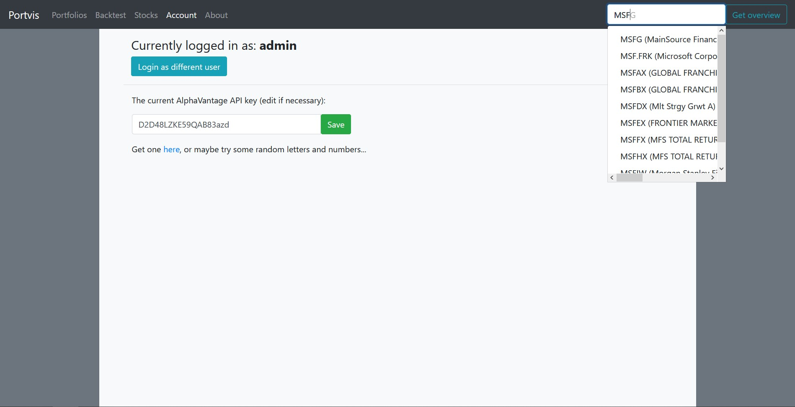
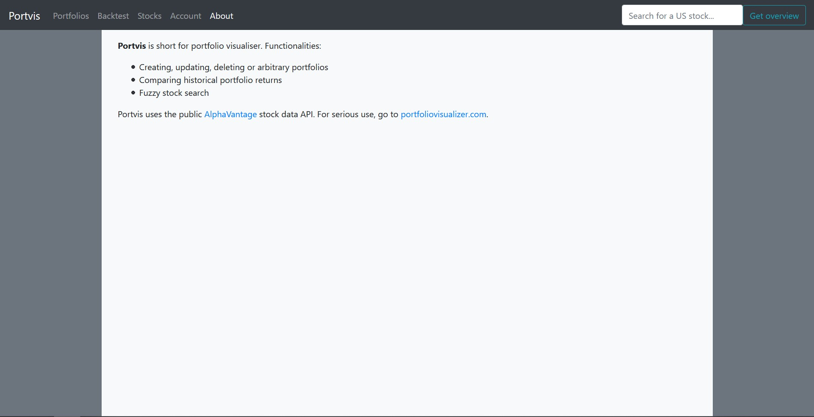

[Github](https://github.com/jonjau/portvis)

A full-stack web application that allows users to visualise and compare
historical returns of US stock portfolios, built with Spring Boot and React.

I have yet to deploy this to a live website. It's a good idea to have TLS
enabled beforehand, to say the least. But working with the bare compute units
offered by AWS's free tier really makes this harder than it needs to be.

Low-res demo:

  

## Screenshots

Pages in order -- login, portfolios, backtest, stocks, account, about:

