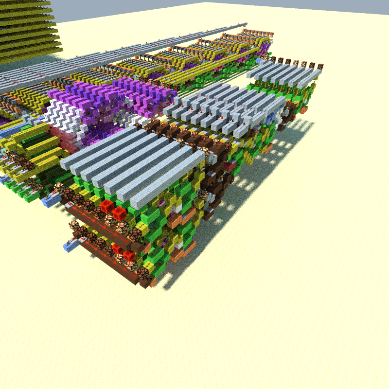
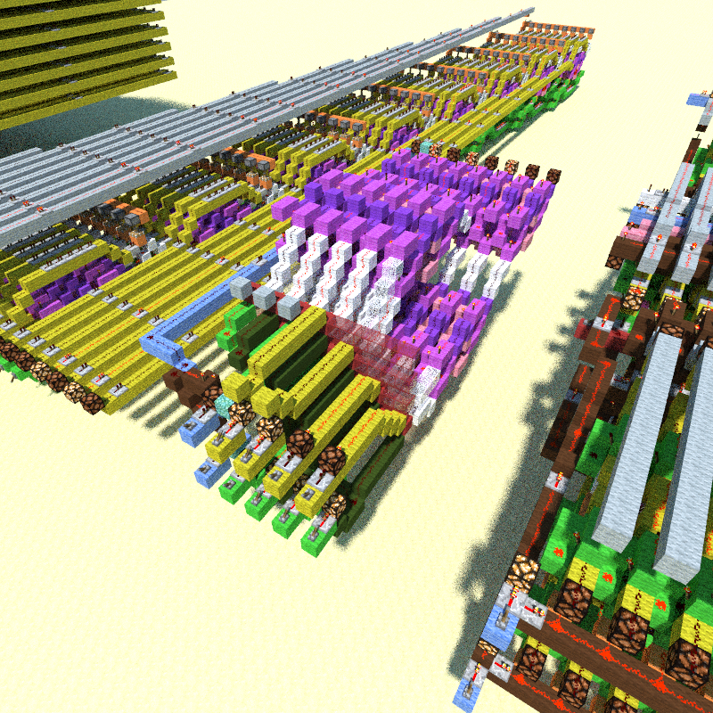
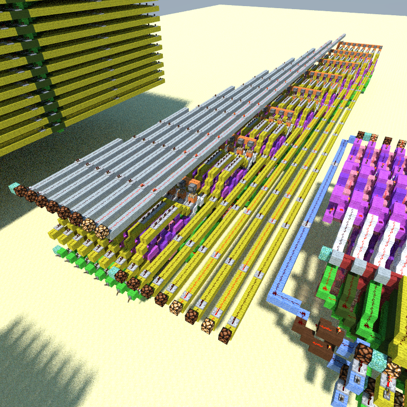
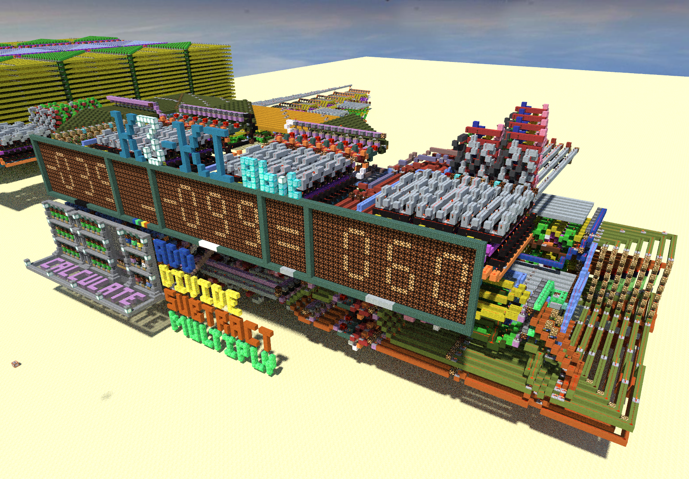
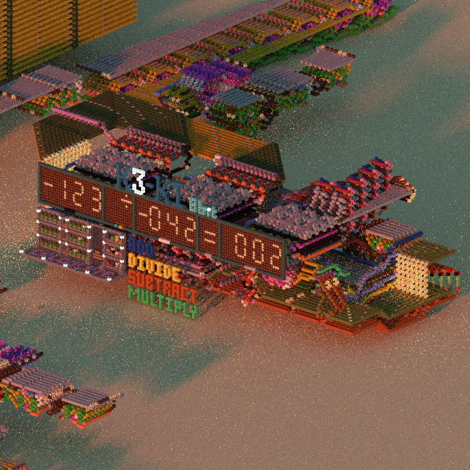
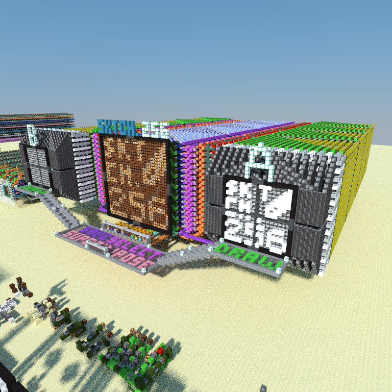
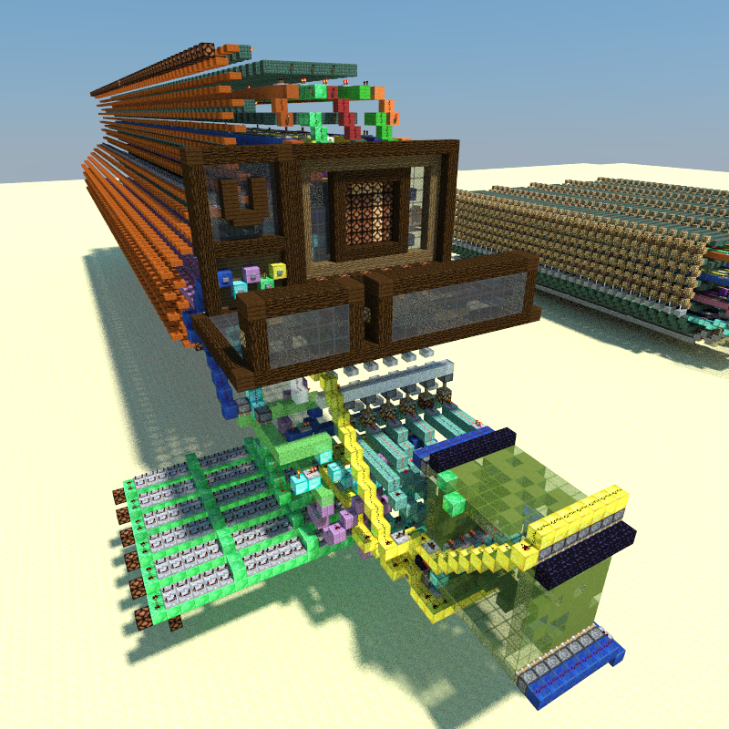

* [Redstone world download on planetminecraft.com](https://www.planetminecraft.com/project/k3-ki-the-8-bit-arithmetic-calculator-sktch-256-the-sketching-machine/)

This post is about the redstone world I worked on until August 2018, which is
available from the link above. It is filled with my experiments with

in Minecraft, exploring how it can be used to simulate basic electronic
circuits, even building up to crude computation and memory.

I thought of redstone as a way to simulate and learn about electronics --
clearly more practical and affordable than buying physical wires and
breadboards! Ultimately it (re)sparked my interest in computers, confirmed my
disdain of working with physical circuits, and so pushed me to pursue CS at
university.

Concepts such as converting binary to binary-coded decimal, logic gates and
volatile memory were useful in the engineering subjects I took years after
this, and having (virtual) hands-on experience really helped.

The world itself had a few major projects, and some details might be missing
since I'm writing this post long after 2018.

## K3-KI

In June 2017, I finished **K3-KI**, an 8-bit redstone calculator in Minecraft.

> I took literal notes from the enlightening videos of
> [Newomaster](https://www.youtube.com/channel/UCZxCEykvr4JCThNO0S9JUmQ).
> I wouldn't have been able to even start this project without his videos.

It contains the 4 basic arithmetic functions, implemented in a
'combinatorial' way, which as I understand means input is turned into
output in a single processing step -- **K3-KI** does not have a clock like a
computer processor does.

### Addition and Subtraction

To start, I copied a compact design for a full adder (with XORs, carry in and
out), then extended that to work with 8-bit binary numbers, this became the
**Addition** module.

The **Subtraction** module is exactly the Addition module, except with
additional negation steps to the *minuend* and the *subtrahend* (cool words).

When working with negative numbers in the
[Two's complement](https://en.wikipedia.org/wiki/Two%27s_complement) form,
addition and subtraction with negative numbers *just works* without further
modification to the Addition/Subtraction module:

### Multiplication

The **Multiplication** module is actually 5-bit and works using bit-shifting.
It's a trick one would see in low-level programming: multiplying `x` by 4,
which is 2 to the power of 2, is the same as shifting `x` in binary by 2
positions. The 5-bit limitation to avoid overflow and the hardwired bitshifts
can be seen in the module itself:

### Division

By far the ugliest implementation, the **Division** module is my own bad
design, essentially a hard-coded form of long division as in elementary
school, with subsequent subtractions and remainder checking. Unsurprisingly,
division by zero is also handled incorrectly.

### Input and Output

The **Input** module is made up of three unintuitive keypads, for the first
and second argument, and the operation. These two numbers are each saved in
8-bit volatile memory module, then the computation is done by directing those
two numbers to the desired module. The wiring for this redirection makes the
bulk of the whole structure.

The **Output** module contains 7-segment decimal displays for the numbers,
supporting `-127` and `128` inclusive, as well as a binary to BCD converter.

Division also truncates:

More pictures are on the Planet Minecraft link above.

## DENTA9

After finishing **K3-KI**, the idea of expanding the breadth of calculations
to 16-bit lingered. It would be necessary to use a 'sequential' approach to do
this since it would be too massive and slow if it were just a blown-up version
of the 8-bit calculator. So I built **DENTA9** -- another play on words in
Japanese...

> How I understood 'sequential' was that processing input and output can be
> done in multiple processing steps, and the intermediate results stored in
> memory. This would be more similar to a typical processor model, with a
> running clock and its own memory.

The same 4 arithmetic functions are present as in **K3-KI**, but it is far
less user-friendly. It does not have proper input/output, cannot handle
negative numbers well and is very slow. It consists of two accumulators:
two adders that are looped and have a 16-bit memory module. The first
accumulator controls the number of times the second accumulator goes, much
like a double for-loop.

### Addition/Subtraction

Addition and subtraction are as in **K3-KI**, they are done with a full adder
in one step.

### Multiplication/Division

Multiplication is simply addition multiple times. The user would input a
number (the first factor), then the number of times to add that to 0
(the "loop num", which would be the second factor).

Division would be the same, except it would subtract multiple times, and
might have a remainder.

## Other redstone projects

Two other highlights in the redstone world were a 16x16 sketching machine and
a 6-bit video player (more like a slideshow machine):

