* [Live customer app](https://snacks-in-a-van-roboto.herokuapp.com/customer)
* [Live vendor app](https://snacks-in-a-van-roboto.herokuapp.com/vendor)

The web development subject INFO30005 taught the basics of the web, how
websites work, and more practical topics such as setting up and doing CRUD on
a NoSQL database, the very basics of React, and so on.

The main assessment was the semester-long project, **Snacks In a Van**. There
was a strict set of functional requirements that were specified to each team:
it had to have two interfaces, one for the customers and another for the
vendors. Both interfaces had to work with phone, tablet, and desktop screen
sizes, so keeping it simple is better.

Customers would be able to login, register, and order food from a fixed menu
which they would then pick up from mobile van, keeping track of waiting time.
Exceeding the waiting time would mean the order is discounted; customers would
also be able to cancel or edit an order before it was completed.

Vendors would be able to login and register, and there would be an option to
open and close (to account for the van moving locations). Each van would be
able to mark customers' orders as completed and picked up.

There were bonus marks for extra functionality, such as live reloading of the
orders list, being able to see the vans as dynamic pins on a map, and customer
ratings. We attempted to implement these too.

## Development

We had a choice between two tech stacks: Express/Handlebars (good old
templating) and Express/React (full-stack with front end and back end). We
opted for the former as it seemed simpler for most of us. We used MongoDB for
the database, Heroku for manual deployment, and not much else. The
integration tests were embarassing.

Though Handlebars allowed us to prototype the simpler, more static pages of
the application as we didn't have to care about CORS issues, the code became
exceedingly messy for the highly dynamic parts of the application, such as the
cart/order page. I wrote the code for that table, and it was pure
unadulterated JavaScript with dynamic DOM manipulation. It constantly felt to
me like going against the idea of templating, but maybe I never was used to
that idea.

Also, it was harder to find drop-in libraries and documentation, as Handlebars
was tiny compared to the phenomenon that is React, and we had to make our own
flaky conventions as we went. In fact, we implemented user sessions in a
highly insecure way...

> Another fun fact is that we hardly used Git properly, many members of our
> team hadn't gotten used to it (this experience would probably be very
> motivating). Instead we developed on a single branch, and someone would
> share their code on Visual Studio Code with Live Share then we would edit it
> live, in sessions usually going for more than 4 hours (once we went for 9
> hours) -- a twisted but effective form of pair programming.

## The Application

**Snacks In a Van** can be accessed from the link(s) at the top of this post.

### Customer placing an order

The customer would first be welcomed by the cozy **Home** page:

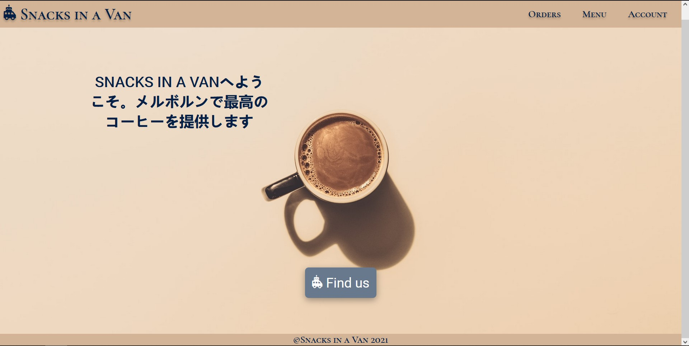

Doing anything other than viewing available vans or the menu would prompt a
user to login. After registering, the customer can log in:

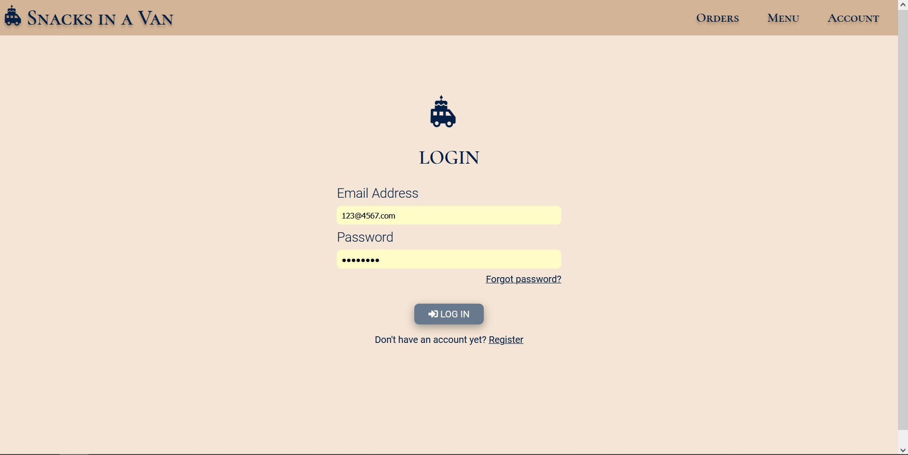

The customer can set the van they are ordering from, and see where that van is
on Google Maps:

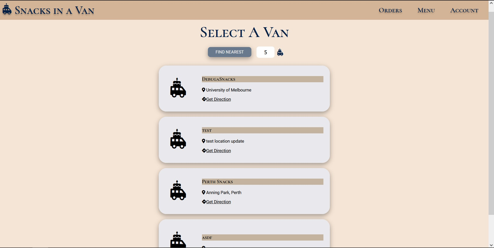

Then they would add items from the menu to their local cart in the
**Menu** page:

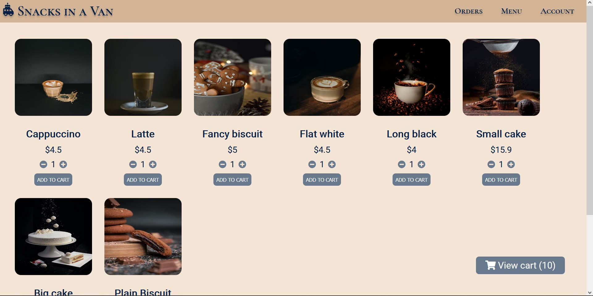

The customer confirms by placing the order, in a screen like this:

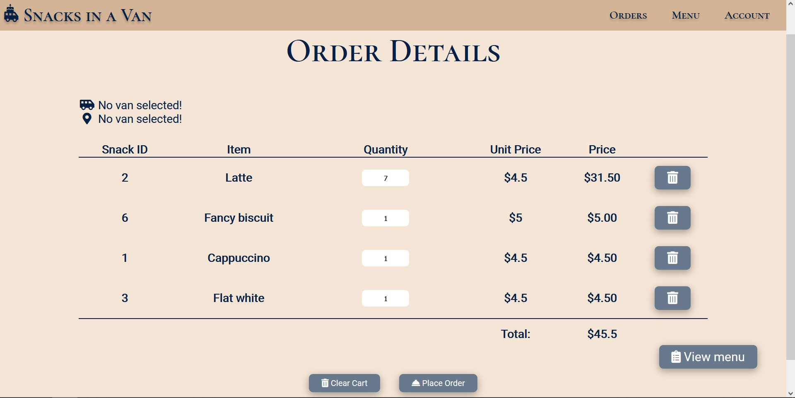

The order will be marked as *preparing*, exceeding 15 minutes will mean the
customer gets a discount. The customer can change or cancel their order
within 10 minutes of placing the order.

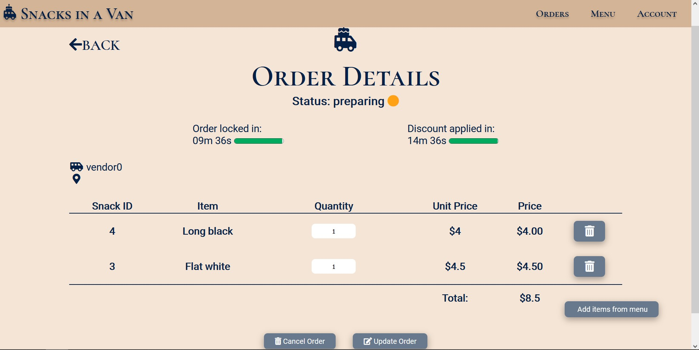

An example of a locked in and discounted order:

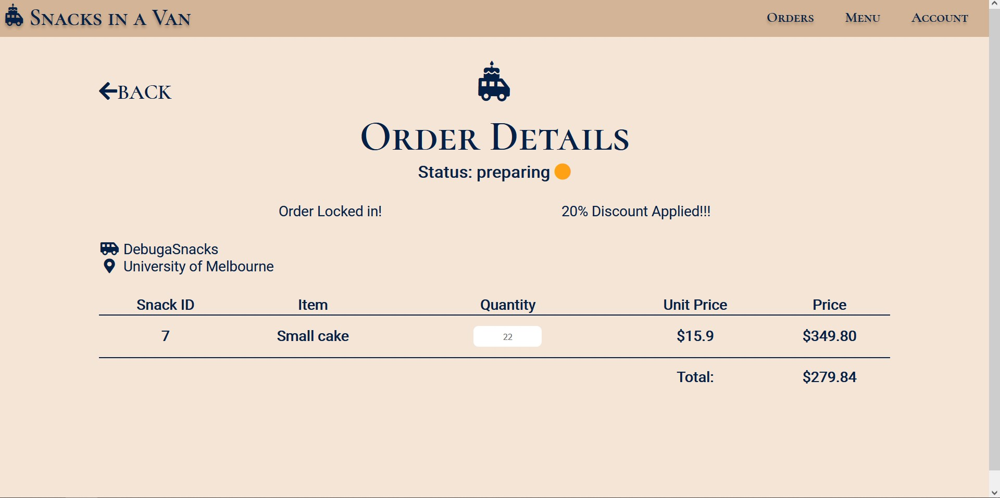

### Vendor fulfilling an order

Vendors also see a **Home** page:

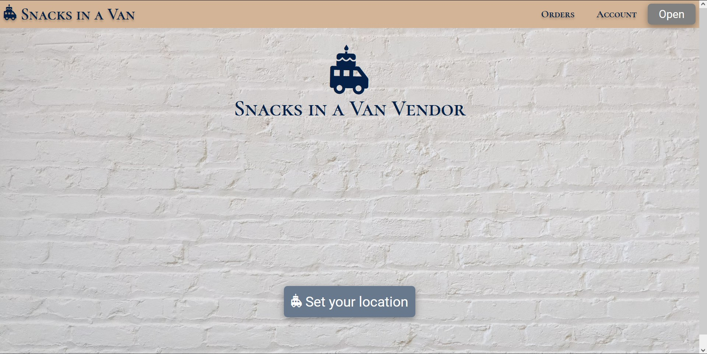

After registering or logging in, they can set their location and open up shop.
Vans must be open before customers can order from them.

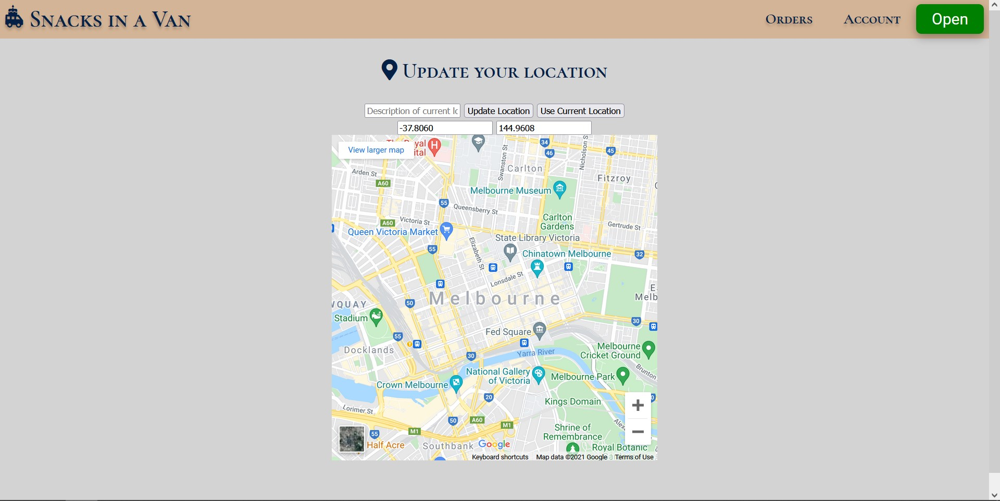

This vendor has received the order from the customer just now, in the
**Orders** page. The vendor is able to filter by status and search orders by
ID, in order to be able to prioritise urgent orders.

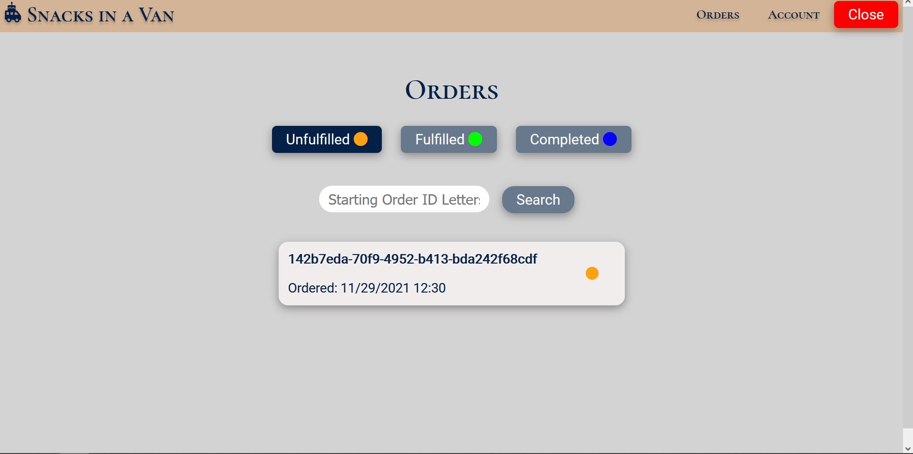

Clicking the 'preparing' order shows the vendor what to prepare and for whom,
and the timers keep going:

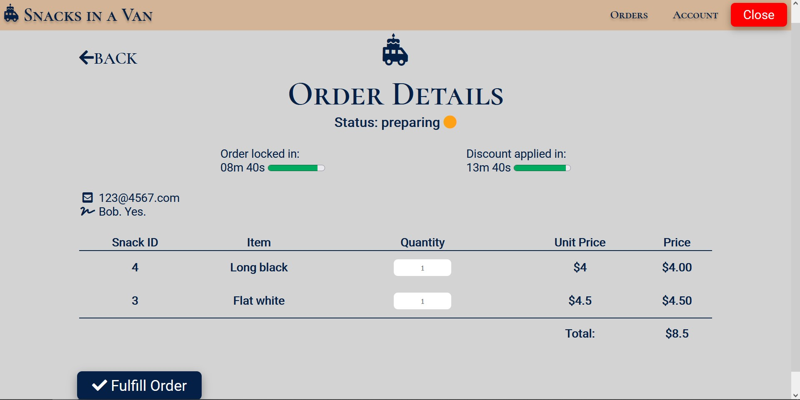

Clicking 'fulfill' means the order is ready, or 'fulfilled'. The discount
timer stops:

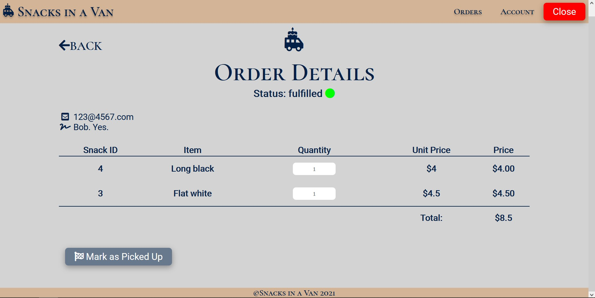

Now the vendor waits for the customer to come and pick it up, before marking
the order as picked up:

### Customer picking up an order

The customer would see their order as 'fulfilled', marked by a green dot,
something like:

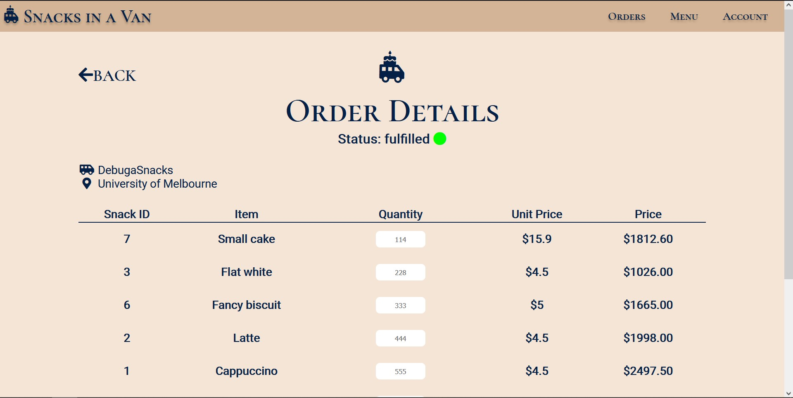

Then they would physically pick up their order from the van.

### Vendor completes an order

After the vendor marks the order as picked up, it will be marked as
'completed':

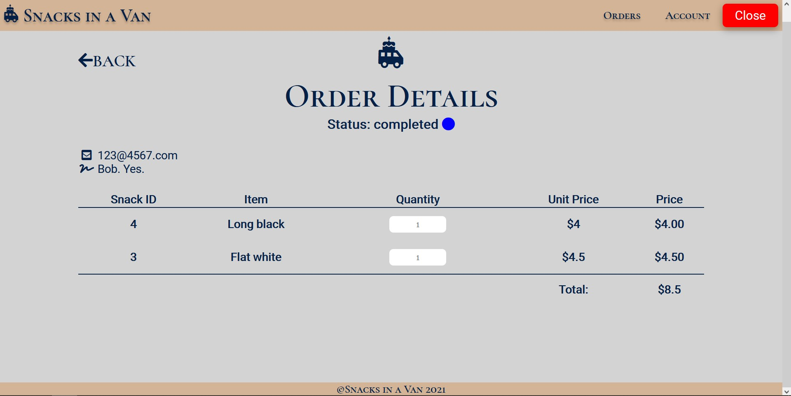

This also updates the list view:

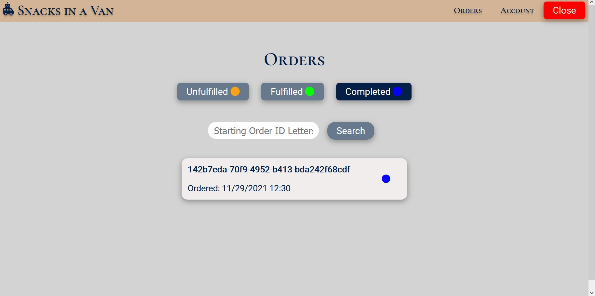

### Customer rates the order

The customer will see the order as completed on their interface:

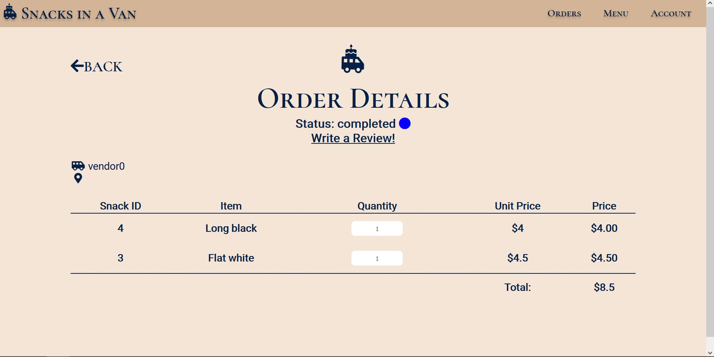

Clicking rate will allow them to leave a review:

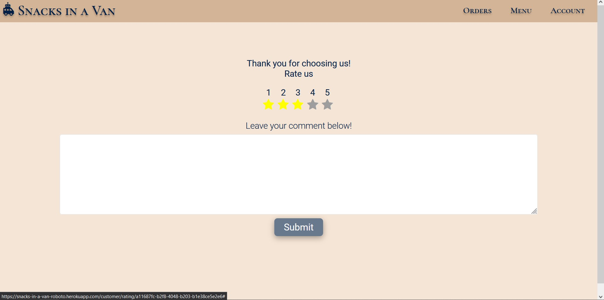

The list view is updated too:

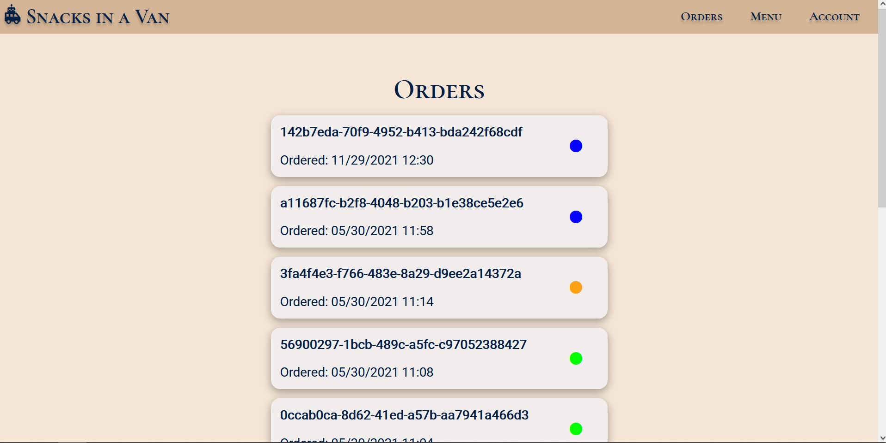

At any time the customer can update their details and log out from the
application from the **Profile** page:

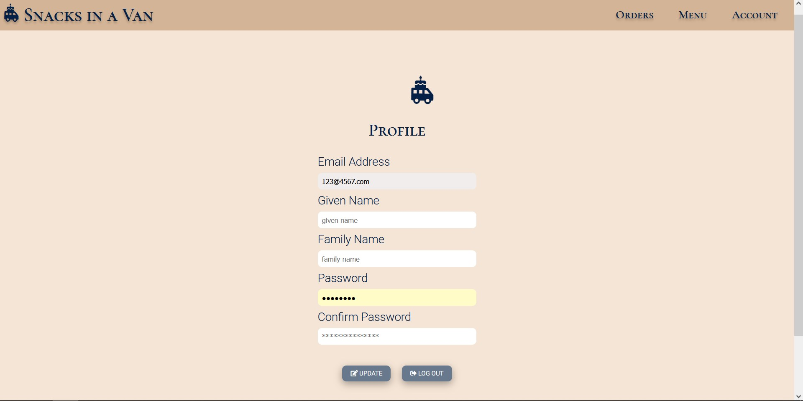

All screens are also responsive:

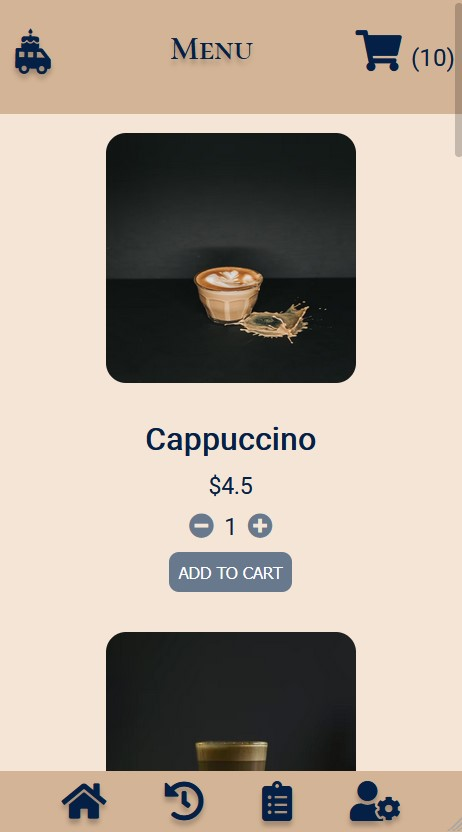
